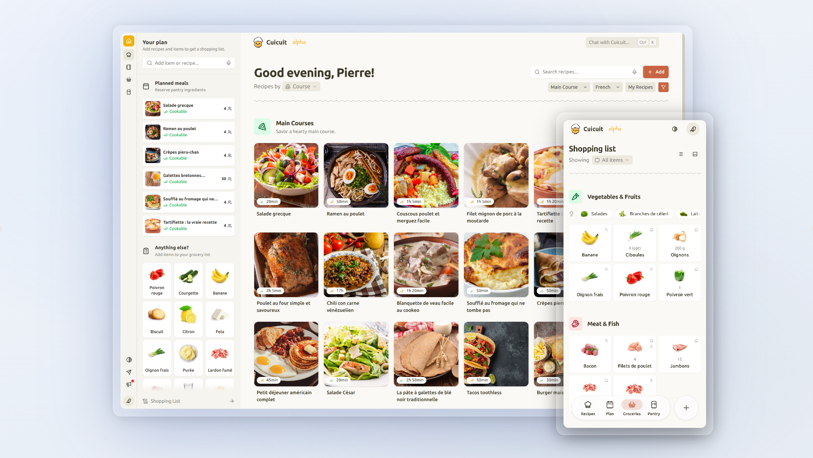

<h1 align="center">
  <a href="https://github.com/MadeInPierre/cuicuit">
    
  </a>
  <br>Cuicuit<br>
</h1>
<h3 align="center">Your favorite kitchen companion!</h3>



> [!WARNING]
> 🐣 **Cuicuit just hatched!** Expect alpha-quality with many bugs and rough edges. Feedback is greatly appreciated!

Cuicuit aims to be your all-round kitchen assistant that helps you decide what to cook, what to buy, and how to improve your diet. It is a personal assistant that helps you plan meals, get automatic shopping lists, and get meal recommendations based on your pantry and habits. The app is designed to be a local-first, privacy-respecting, and open-source app that you can self-host or use via a crowd-funded hosted version. 

Cuicuit is built and maintained in my free time. I’d love to keep improving it and make it useful for more people. If you like the project and want to help it grow, [your support](https://github.com/sponsors/MadeInPierre) makes a real difference ❤️

🥁 P.S. French wordplay of the day: *cui-cui* is how we write the sound of a bird (aka. *chip-chip*) and *cuit* means *to cook*. French people often say *c'est cuit* meaning *it's ready*, now we can all say *c'est cuicuit*! 


## 🗺️ Roadmap

This roadmap presents my rough evolution plan of Cuicuit. Your feedback is very welcome, I hope to make Cuicuit useful to everyone! [Vote for features](https://github.com/MadeInPierre/cuicuit/discussions/categories/ideas) to help adjust the roadmap and prioritize the most important features. Items marked with 🚧 are currently in progress.


<details><summary><strong>🥚 Step 0: Open source & Project foundations 🚧</strong></summary>

*Focus: Establish an open-source, documented foundation for Cuicuit with a hosted offering and self-hosting guides.*

* [ ] **🚧 Hosted version**
  * [x] Publicly hosted version for testing and feedback
  * [x] User authentication and account management
  * [x] Basic multi-user support with isolated spaces
  * [ ] Security and privacy enforcements
  * [ ] Shared crowd-funded moneypot for LLM and hosting costs
* [ ] **Self-hosting**
  * [ ] Dockerized deployment & documentation for easy self-hosting
  * [ ] Environment variable configuration for customization
  * [ ] Database setup and migration scripts
* [ ] **Open-source readiness**
  * [ ] Public GitHub repository with clear contribution guidelines
  * [ ] Code of Conduct and License (MIT)
* [ ] **Documentation**
  * [ ] README with project overview and setup instructions
  * [ ] Contribution guidelines for developers
* [ ] **Offline support**
  * [ ] Local-first architecture with a sync engine (PowerSync/Zero/SQLite, TBD)
</details>

<details><summary><strong>🐣 Step 1: Import recipes, plan meals, get shopping lists 🚧</strong></summary>

*Focus: Import recipes from anywhere. Organize them, then add them to a meal plan to get a nice shopping list.*

* [x] **Shared households**
  * [x] Create one or more isolated "home" spaces (e.g., Home, Parents' house)
  * [x] Share spaces with other users to collaborate
  * [x] Invite users to your spaces
  * [ ] Real-time UI feel using a sync engine
* [ ] **The recipe engine**
  * [x] Import recipes from easy-to-import websites or create your own
  * [ ] Understand and convert ingredient quantities and units
  * [ ] Organize recipes in shareable cookbooks
  * [ ] Robust recipe import from web pages, social media, photos, and text
  * [ ] Interact with recipes: Like, rate, categorize, and clone/customize existing ones
  * [ ] Discover recipes from the community (random roll, search by name, filter by category)
* [x] **Basic meal planning**
  * [x] Add recipes to a simple dateless meal plan
  * [ ] Add additional ingredients & custom items
* [ ] **Shopping list generation**
  * [x] Automatically generate a shopping list
  * [x] Suggest items based on past purchases
  * [ ] Sort & group items by aisle, meal, or cart status
</details>

<details><summary><strong>🐥 Step 2: Meal recommendations from your pantry</strong></summary>

*Focus: Linking the pantry to meal planning and dynamically generating the primary shopping flows.*

* [ ] **Pantry management**
  * [ ] Add pantry items with categories, quantities, expiration dates, and storage locations
  * [ ] Import pantry items from receipts, supermarket APIs, or smart scales
  * [ ] Quantity tracking with automatic unit conversions
  * [ ] Storage locations (Fridge, freezer, pantry shelf)
  * [ ] Expiration dates estimation and reminders
* [ ] **Closing the loop: Pantry-Meal-Grocery Reservation Engine**
  * [ ] Connect pantry directly to planned meals and automatically reserve items for each meal
  * [ ] Adapt the grocery list based on pantry availability and reserved items
  * [ ] Top-to-bottom "cookability" state for each meal
  * [ ] Suggest substitutions for missing ingredients
  * [ ] Clear notifications alerting users to missing items for scheduled meals
* [ ] **Dynamic Shopping List Generation**
  * [ ] Auto-generate lists directly from the meal plan requirements
  * [ ] Quick-action cart status toggles (In cart vs. Needed)
  * [ ] Manual override: Add custom items (including general household goods)
</details>

The next steps are more long-term and subject to change from your feedback:

<details><summary>🐓 Step 3: Intelligent Context & Prediction</summary>

*Focus: Turning the app into a proactive companion using rules-based automation and consumption behaviors.*

* [ ] **Contextual & Predictive Pantry Rules**
  * [ ] Set "Minimum Quantities" per item to auto-trigger shopping list additions regardless of meal plan
  * [ ] Consumption habits and pantry probabilities (e.g. assume 100g of cereal daily for breakfast)
* [ ] **Smart Recipe Recommendations**
  * [ ] Quick-scale party filters (e.g., "Ideas for `(-)` 2 `(+)` people")
  * [ ] Contextual badges for recipe matches: *Ready to Cook*, *Change of Plans*, or *Groceries Needed*
  * [ ] Reason-based suggestion badges (e.g., *"Uses up items about to expire"*)
  * [ ] Top-of-page interactive assistant recommending tailored search filters
* [ ] **Pantry Chronology & Simulation**
  * [ ] Step through your planned timeline to view calculated future pantry states
  * [ ] Hover states over specific meals to preview exactly what remains in the fridge afterwards
  * [ ] "Time travel" mechanics: Override and set a simulated future pantry state as the active current state
  * [ ] Feed future simulation states directly into the recommendation engine to easily pivot dinner plans
</details>

<details><summary>🦅 Step 4: Passive Automation & Advanced Inputs</summary>

*Focus: Drastically reducing user manual updates via smart interfaces, probabilistic modeling, and commercial integrations.*

* [ ] **Streamlined Inventory Inputs**
  * [ ] Manual slider adjustments
  * [ ] Hardware integrations (Smart scale data feeds)
  * [ ] Text & image-based input processing (Groceries receipt scanning / OCR parsing)
  * [ ] Direct supermarket API inventory loading
  * [ ] Explicit "Mark recipe as cooked" triggers to batch-decrement inventory
* [ ] **Supermarket & Drive Modes**
  * [ ] Live grocery cart verification
  * [ ] Barcode scanning for immediate cart loading and localized nutrition insights
  * [ ] **Drive Mode:** Programmatic checkout and automated online order purchasing via Supermarket APIs
* [ ] **Probabilistic Inventory Tracking**
  * [ ] Support quantity variance ranges (e.g., tracking "1-2 onions" instead of exact grams)
  * [ ] Habit-based predictive quantity engine derived from historical data
  * [ ] Periodic low-friction micro-checkins asking users to quickly verify true quantities
* [ ] **The Autonomous Kitchen Wizard**
  * [ ] Continuous, algorithmic meal plan pre-filling based on learned user profiles
  * [ ] Soft-ui states: Display suggestions as half-faded layouts for swift confirm/switch/remove interactions
  * [ ] Profile toggles: Familiar vs. Discover balancing, Flexitarian settings, and Mood adjustments
  * [ ] Kill-switch toggle to fully disable auto-filling behaviors
</details>

<details><summary>🪐 Step 5: The Extended Ecosystem (Long-Term Vision)</summary>

*Focus: Deep history, advanced AI, hyper-local networks, and environmental footprint tracking.*

* [ ] **Generative AI Enhancements**
  * [ ] Fully generative recipe drafting utilizing chaotic or highly specific left-over ingredient bundles
  * [ ] **Mood Radio:** Natural language interface accepting prompts (e.g., *"Comfort food for a rainy Sunday"*) to spin up targeted meal flows
* [ ] **History, Audits, & Micro-Reminders**
  * [ ] Complete chronological tracking of pantry states, meal plans, and old receipts
  * [ ] Universal "Undo" capability for accidental pantry edits or incorrect cooking logs
  * [ ] Contextual surface of historic ratings and personal notes directly into main recipe cards and search engines
  * [ ] High-signal household messaging (e.g., *"Pinging home group: I'm at the store, need anything?"*)
* [ ] **Sustainability, Wellness, & Local Supply Chains**
  * [ ] Comprehensive nutritional scoring, analytics, and target adjustments
  * [ ] Carbon footprint ($CO_2$) and direct water usage approximations per ingredient choice
  * [ ] Food waste tracking metrics and cost-loss summaries
  * [ ] Dietitian Portal: let certified nutritionists securely analyze your stats or curate your meal plan
  * [ ] Local producer aggregation: Automatically suggest sourcing options from nearby independent farms alongside standard supermarket delivery loops
</details>

Feel free to suggest other features!


### Deprecated

<details>
<summary>Deprecated</summary>

# Features:

- [X] Create one or more "home" spaces (e.g. home, work, parents' house...)
- [X] Share homes with other users to collaborate in real-time
- [ ] Create recipes
- [ ] View recipes from other users (random recipes, search by name, search by category)
- [ ] Like recipes, organize them in categories, rate them, customize them
- [ ] Create a meal plan (with no dates for now) by adding recipes into planned meals
- [ ] Generate a shopping list from the meal plan
  - [ ] Shopping list page: group by recipe, supermarket aisle, in cart or not, etc.
  - [ ] Show ingredients generated from the meal plan, from the pantry minimum quantities
  - [ ] Manually add items (including household items)
  - [ ] Ask what to do with expired items (e.g. mark as trashed and add to the shopping list, or cook it now?)
  - [ ] Show the total price of the shopping list
- [ ] Create a pantry with:
  - [ ] Items (ingredients, home articles...)
  - [ ] Categories (fruits, spices...)
  - [ ] Quantities (amount, unit with conversions)
  - [ ] Expiration dates
  - [ ] Location (fridge, freezer, pantry...)
  - [ ] Tags (opened, to buy...)
  - [ ] Habits (e.g. 100g cereals or eggs for breakfast) to auto-consume items
  - [ ] Minimum quantity (e.g. 1L milk) to auto-add to the shopping list even without planned meals
- [ ] Reserve pantry items to the meals of the meal plan
  - [ ] Reserve from top to bottom of the list, notify the user if there are missing items
- [ ] Update the pantry quantities: 
  - [ ] Manual input
  - [ ] Smart scale
  - [ ] Groceries receipt scan
  - [ ] Supermarket API
  - [ ] Mark recipes as cooked to update the pantry
- [ ] Recipe smart suggestions: based on your pantry, expiration dates, your meal plan, your liked recipes, etc.
  - [ ] Button on top as "Ideas for (-) 2 (+)" people
  - [ ] Give ideas of recipes "ready to cook", "change of plans" or "groceries needed"
  - [ ] Small badges on the recipe suggestions give the reason (e.g. "This item is about to expire")
  - [ ] On top of the page, an assistant gives suggestions of filters (e.g. Search with soon-to-expire items?)
- [ ] View your pantry anytime in the calendar/between planned meals: simulate what your pantry will be
  - [ ] In the calendar view, hover over a meal to see the pantry status after this meal
  - [ ] Set any of these pantry states as the current pantry state
  - [ ] Recipe suggestions will be based on this pantry states
  - [ ] Useful for changing plans and seeing the consequences on the pantry
  - [ ] Wizard mode (see below) will use this feature to generate recommendations day-by-day

[Long term features]
- Supermarket mode: 
  - Mark items as bought (i.e. in the cart)
  - Scan barcodes to add items to the cart and get nutrition insights
  - Drive mode: automatically buy items online (e.g. from the supermarket API)
- Pantry quantity uncertainty: you can specify a quantity with a range (e.g. 1-2 onions)
  - Define habits for each item (e.g. usually breakfast with 100g cereals or 2 eggs)
  - Algorithm to suggest the quantity based on habits and past updates
  - Ask the user to update the exact quantity from time to time
- AI suggestions: 
  - Propose unique recipes or meals (combining recipes or simple ingredients) based on your pantry
  - Radio: input any text that describes your mood, and the AI will suggest recipes based on that
- Notify other users in the home you're going to groceries, do they need something?
- History mode: see the history of your pantry, meal plans, recipes, etc.
  - Show past ratings and comments on recipes in the recipe suggestions/search/pages
  - Undo changes in the pantry/meal plan
  - View past receipts, log of groceries bought and consumed items/meals, etc.
- Wizard mode: Cuicuit learns the user's habits and continuously fill the meal plan
  - For example, if you mostly eat simple meals at dinner, Cuicuit will suggest simple recipes
  - Suggestions are half-faded in the UI, and the user can click on them to confirm/switch/remove
  - This will always make the shopping list full of things to buy, should have a setting to disable this?
  - Settings: Familiar/Mixed/Discover mode, Flexitarian mode, Higher mood than usual, etc.
- Super long term: Nutrition insights, C02 and water footprint, waste tracking, spending tracking, etc.
  - Nutritionists can help you generate a meal plan based on your goals (they add recipes to your meal plan or share custom-made cookbooks)
  - Search for local producers to buy from them, also auto recommended in the shopping list page alongside the supermarket drive mode

# File structure

```
src/
    routes/
        api/
            +server.ts
            local-action.ts
        home/
            [id]/
                +page.svelte
        +layout.svelte
        +page.svelte
        LocalComponent.svelte

    lib/
        shared/
            components/
                icons/
            utils/
            server/

        features/
            marketing/
                components/
                    MarketingNavbar.svelte

            app-skeleton/

            auth/
                1. components/
                2. state/
                3. actions/
                5. models/
                    schemas.ts (zod schemas)
                    models.ts (ui-only object types)
                6. db/
                    models.ts (UserDoc, ...)
                7. server/
                    create-user-doc.ts
                8. constants/
                    navbar-links.ts


            recipes/
                db/
                    models.ts (Recipe model)
                
            pantry/
                items/
                categories/
                ...
```

This structure is inspired by:
- The feature-based architecture presented in this [YouTube video](https://www.youtube.com/watch?v=xyxrB2Aa7KE)
- The Feature Sliced Design pattern presented in this [article](https://dev.to/m_midas/feature-sliced-design-the-best-frontend-architecture-4noj)
- The Immich app architecture they use, see their [GitHub source tree](https://github.com/immich-app/immich/tree/main/web/src)

At the root of the `src/` folder, we have:
- `routes/` for the pages of the app
- `features/` for the different features or domains of the app. Each feature has its own folder with the structure (ordered from most frontend to most backend):
    - `components/` for the components of the feature
    - `state/` for the state management of the feature
    - `actions/` for the actions of the feature
    - `models/` for the models of the feature
    - `db/` for the database models of the feature
    - `server/` for the server-side logic of the feature
- `shared/` for shared files used globally in the app. This folder uses the same structure as the `features/` folder.

</details>
